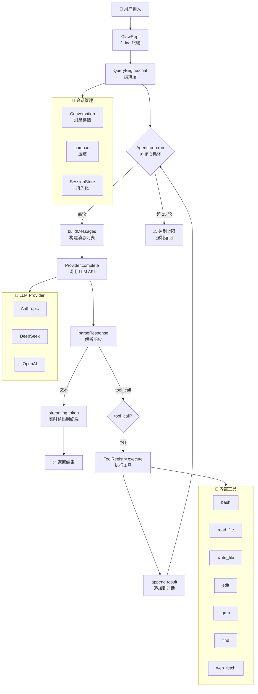

# 🦞 Claw-Java

**Claude Code 架构的 Java 21 移植版** — 从泄露的 TypeScript 源码分析后，用 Java 重新实现的 Agent 核心引擎。

> 📖 学习项目，不是 Claude Code 的替代品。目标是让你理解 Agent 的架构精髓，而不是绕过 Anthropic 的定价。

## ✨ v1.1 更新

- **统一消息模型** — 消除 claw-core ↔ claw-provider 双重类型，ProviderRequest 直接使用核心 Message/ToolCall
- **流式输出** — AgentLoop 支持 streaming token 回调，REPL 实时渲染
- **工具扩展** — 新增 `edit`（精准替换）、`web_fetch`（抓取网页）、`find`（文件查找）工具
- **精确 Token 计数** — 接入 jtokkit (CL100K_BASE)，自动回退到 char/4
- **权限系统** — PermissionManager 已接入 AgentLoop，支持 NONE/ASK/ALLOW_ALL 三级控制
- **工作目录穿透** — Tool 接口支持 workingDirectory()，BashTool/文件工具自动遵循

## 🏗 架构

```
┌─────────────────────────────────────────────┐
│                  claw-cli                    │
│         JLine REPL (交互式终端)              │
│         ClawContext (手动 DI)                │
└──────────────────┬──────────────────────────┘
                   │
    ┌──────────────┼──────────────┐
    ▼              ▼              ▼
┌────────┐  ┌────────────┐  ┌──────────┐
│claw-core│  │claw-provider│  │claw-tools│
│ 引擎    │  │ API适配层   │  │ 工具系统  │
└────────┘  └────────────┘  └──────────┘
```

### 模块

| 模块 | 对标源码 | 功能 |
|------|---------|------|
| **claw-core** | `packages/agent/query.ts` | AgentLoop（核心循环）、QueryEngine（编排层）、Conversation（会话管理） |
| **claw-provider** | `packages/provider/` | Provider SPI、Anthropic/OpenAI/DeepSeek 实现 |
| **claw-tools** | `packages/tool-registry/` | Tool 接口、注册表、7 个内置工具（Bash/读文件/写文件/grep/edit/web_fetch/find） |
| **claw-cli** | `packages/cli/` + `packages/repl/` | JLine REPL、命令解析、上下文装配 |

## 🚀 快速开始

```bash
# 需要 Java 21 + Maven 3.8+
git clone git@github.com:hupp1203-cmd/claw-java.git
cd claw-java

# 设置 API Key（三选一）
export ANTHROPIC_API_KEY=sk-ant-...
# 或
export DEEPSEEK_API_KEY=sk-...

# 编译运行
mvn install -q -DskipTests
mvn exec:java -pl claw-cli
```

```
╔══════════════════════════════════════════╗
║            🦞  Claw-Java                  ║
║  Claude Code architecture in Java 21     ║
╚══════════════════════════════════════════╝
Provider: anthropic | Model: claude-sonnet-4-20250514

claw> 帮我读一下 pom.xml
claw> /tools
claw> /model deepseek-chat
claw> /help
claw> /exit
```

## 🧠 核心架构图



> 上图是 Agent 主循环的完整流程 — 对标 Claude Code 的 `query.ts` 架构。

## 📁 关键源码导览

### 最值得读的 5 个文件

| 文件 | 说明 |
|------|------|
| `claw-core/.../AgentLoop.java` | **★ 核心循环** — 最精华的部分，从 `query.ts` 翻译过来 |
| `claw-core/.../QueryEngine.java` | 编排层，管理会话生命周期 |
| `claw-provider/.../AnthropicProvider.java` | Anthropic Messages API 适配 |
| `claw-cli/.../ClawContext.java` | 手动依赖注入，桥接各模块 |
| `claw-tools/.../ToolRegistry.java` | 工具注册与分发 |

### 文件数量

```
claw-core/      14 Java files  (AgentLoop, QueryEngine, Message, Conversation, TokenCounter...)
claw-provider/   6 Java files  (Provider, AnthropicProvider, OpenAI, DeepSeek...)
claw-tools/      8 Java files  (Tool, ToolRegistry, BashTool, ReadFileTool, EditTool, WebFetchTool...)
claw-cli/        3 Java files  (ClawApplication, ClawRepl, ClawContext)
```

## 🔍 与原版的关键对照

| 概念 | Claude Code (TypeScript) | Claw-Java (Java 21) |
|------|-------------------------|---------------------|
| 主循环 | `query.ts` 生成器函数 | `AgentLoop.run()` with for 循环 |
| 编排器 | `QueryEngine.ts` | `QueryEngine.java` |
| Provider | `claudeLegacyRuntime.ts` | `AnthropicProvider.java` |
| 工具注册 | `tool-registry/src/tools/` | `ToolRegistry` + `Tool` interface |
| 会话压缩 | `Conversation.compact()` | `Conversation.compact()` (相同逻辑) |
| 权限 | `permission/` | `PermissionManager` + `PermissionLevel` enum |
| 状态管理 | Zustand store | 手动 DI (ClawContext) |

## 🎮 Demo

飞机大战游戏由 Claw-Java 自主升级：[hupp1203-cmd.github.io/plane-war](https://hupp1203-cmd.github.io/plane-war/)

> **v2 — 手机端适配**：触摸滑动控制、全屏自适应、暂停/继续、退出按钮、刘海屏适配
>
> v1 升级内容：WASD 键盘控制、3条命系统、localStorage 最高分 — 全部由 Claw-Java 自主完成。

## ⚠️ 免责声明

本项目**仅供学习研究**。基于对 Anthropic Claude Code 泄露源码的架构分析（非代码复制），用 Java 重新实现了相同的架构模式。不包含 Anthropic 的专有代码、训练数据或模型权重。

没有复制一行 TypeScript 代码。架构模式的重新实现属于「思想」层面，不受版权保护。

## 📄 License

MIT
